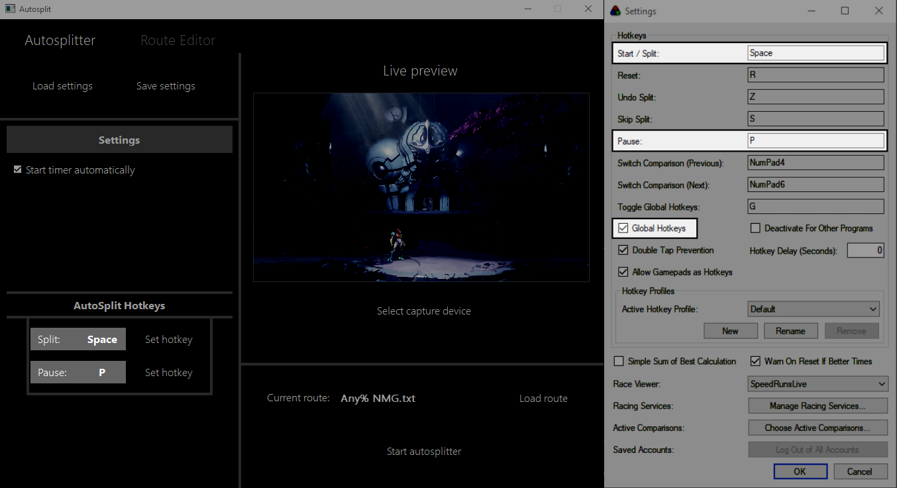

# Metroid-Dread-Autosplit
- ## **This README is not fully complete yet.**

This is an autosplitter/load remover for Metroid Dread that aims to remove major loading time differences from the run. It does this by analyzing your capture card's live video feed and sending keyboard input when necessary. As a result, this makes it compatible with any speedrun timer as long as it supports global hotkeys (such as LiveSplit).
## How to use
To start the autosplitter in the program, these are the basic steps:
1. Select your capture device when the program asks for it.
2. Ensure your speedrun timer has global hotkeys enabled.
3. Set the hotkeys in the program to match your speedrun timer's hotkeys. 
    - For example:
    
    
    
4. Load a route file 
5. Start the autosplitter

## Route file?
A route file is just a text file with a series of transports that helps the program know when it should pause correctly.

The program comes with routes for you to use, but you can make your own or edit an existing one if you need to.

The easiest way to create or edit a route file is to just use the built-in route editor with the program:
- The route will appear on the right, with the currently selected transport highlighted.
- The buttons on the very left allow you to specify a transport to use. 
- Once you've selected a transport, the middle buttons allow you to insert it.
- "Insert Above" and "Insert Below" will insert in relation to the highlighted transport on the right.
- Once you're done making the route, save it. 
- This route can now be loaded into the main tab of the program.

## Settings
Settings can be saved or loaded like routes. Settings include:
  - Starting the timer automatically
  - Split hotkey
  - Pause hotkey
  - Last route used

In addition to this, your current settings are continuously updated and saved into a separate file. 
This makes it so that when you start the program, it will load these settings automatically for convenience.

## Building/Developing on Windows
To build the application yourself (for developers), follow these steps.

1. Download and install [Qt Open Source (6.2.1)](https://www.qt.io/download-open-source).
  1. If you already have a Qt installation go to its directory and run `MaintenanceTool`.
  2. Create an account if you do not have one or log in.
  3. Click through the Wizard selecting *Add or remove components*.
  4. Find *Qt 6.2.1* in the list, expand it, and select the following items:
    - MSVC 2019 64-bit
    - Sources *(optional, for debugging)*
    - Qt Debug Information Files *(optional, for debugging)*
2. Download and extract [OpenCV 4.5.4](https://opencv.org/releases/).
  1. Create an [environment variable](https://windowsloop.com/add-environment-variable-in-windows-10) called `OPENCV_DIR` and point it to the `opencv` directory.
3. Download and install [Visual Studio 2019: Community 2019](https://visualstudio.microsoft.com/vs/).
  1. In the **Workloads** tab, select *Desktop development with C++*.
  2. In the **Individual components** tab, select *Windows 10 SDK*.
  3. Once installed, open `Autosplit.sln` then go to *Extensions* -> *Manage extensions*, find and download **Qt Visual Studio Tools**.
  4. Go to *Extensions* -> *Qt VS Tools* -> *Qt Versions* and add your Qt version to the list (as `6.2.1_msvc2019_64`).
  5. Build the project.

## Credits
- Created for the wonderful [Metroid Dread Speedrun Discord](https://discord.gg/BdmYr5TRGT) by OnlySpaghettiCode
- https://github.com/Aoderus for his super useful [capture device listing tool](https://github.com/Aoderus/OpenCV_CameraList_MSMF)
